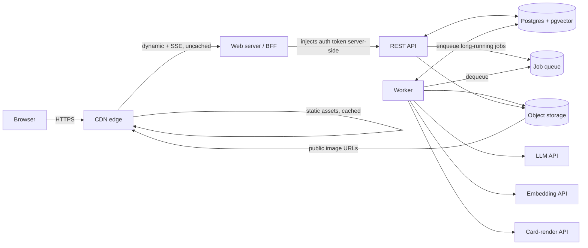
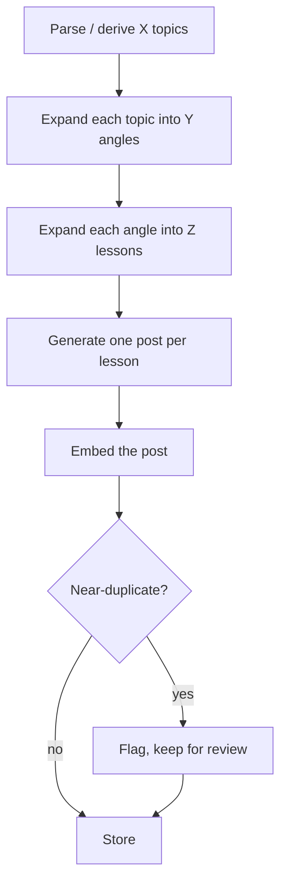

# Architecture

This is the conceptual map for the other two documents. **This file**
describes what the system actually is, independent of any cloud provider —
the shape that has to hold true whether it runs on a laptop, AWS, or
anywhere else. `aws-architecture.md` describes the current AWS realization of
this shape, and why each AWS-specific choice was made. `IaC.md` is the build
plan for provisioning that realization.

## Platform-agnostic architecture

At its core, Conflow is a pipeline with a human approval gate in the middle:
generate a matrix of LinkedIn post drafts in one voice, check them against
everything written before, let a human review and approve, publish manually.
Four kinds of component make that happen, and the boundaries between them
are deliberate, not incidental.

### The four kinds of component

- **Edge (CDN).** The one thing every request touches first. Caches static
  assets; passes everything dynamic — including the live progress stream —
  straight through uncached. Also fronts the rendered card images, so they
  get a public URL without the object store itself being public.
- **Web server (BFF).** The *only* thing that's actually reachable from the
  internet besides the CDN. Its one job: serve the built frontend, and proxy
  API calls with the real auth token injected server-side, so that token
  never reaches the browser. Deliberately dumb — no business logic lives
  here.
- **API.** Everything synchronous: reads, approvals, edits, and the handful
  of writes that are cheap enough not to need a queue (a single card render,
  an edited post's re-embed). Never directly reachable from outside — only
  the BFF talks to it.
- **Worker.** Everything that's slow or expensive: the actual generation
  pipeline, batch card rendering, corpus re-seeding. Pulls jobs from a queue
  instead of being called directly, so it can scale independently of request
  traffic and recover from being killed mid-job.

Data layer underneath all four: **Postgres** is the one source of truth —
every other signal (a queue's notion of "done", an in-memory cache, a push
event) is a convenience layered on top of it, never a replacement for
reading the database. **Object storage** holds the one kind of large,
immutable artifact the system produces (rendered card images), referenced by
a content-addressed key, not a post ID — identical content never gets
rendered or stored twice, regardless of which post points at it.

### The generation pipeline itself

Three levels of fan-out, driven entirely by three numbers set per run — X
topics, Y angles per topic, Z posts per angle:

A **topic** is the real subject. An **angle** is one way of framing it — the
database's unit of "a topic row" is actually one *(topic, angle)* pair, not
the bare topic. A **lesson** is one concrete, self-contained point, and every
lesson becomes exactly one post. Topics and angles and lessons are each
fetched with a single model call returning the whole list; posts are the one
level generated one-at-a-time, since each needs real care, not a short
label.

### Intricacies worth knowing before changing any of this

**Duplication is checked in two tiers, at two different tolerances.** A
freshly generated post is compared against its own siblings (other variants
of the same angle, generated in this run) at a tight similarity threshold —
they're expected to be related, so only near-identical text gets flagged.
It's separately compared against a recent ledger (the seed corpus plus
standing posts from other topics, within a rolling time window) at a looser
threshold — the goal there isn't "never repeat a word," it's "don't say the
same thing again *soon*." An old echo from months back is fine; a
near-identical post from last week isn't.

**The database is the only thing anything trusts.** The queue's own
bookkeeping — job state, a push notification that a job finished — is
useful for nudging a UI to refresh sooner, never for deciding what's
actually true. A client that reconnects after missing every intermediate
event just re-reads the database and is correct again, with nothing lost.
This single decision is what makes several other things simple: the live
progress stream doesn't need a replay buffer, and a worker interrupted and
resumed later doesn't need to coordinate with whatever update it already
sent.

**Generation work is resumable, checkpointed below the level of a whole
run.** A run that gets interrupted — a crash, a queue redelivery, a host
reclaiming capacity — doesn't start over. Each level of the pipeline
persists its own decision the moment it's made (which angles a topic
resolved to, which lessons an angle resolved to, the random slot/style
assignment for every post in the run) *before* moving on, so a resumed
attempt replays nothing it's already paid for — it just picks up at
whichever post is still missing. A run only becomes untouchable once it's
genuinely finished; a failed run is explicitly not a dead end, since failure
is sometimes transient and there's no reason a resolved problem should stay
stuck forever. Two different kinds of duplicate work are guarded against
separately: a lock scoped to the whole run stops two attempts at the *same*
run from running concurrently at all; checking what's already stored before
generating anything new stops a single resumed attempt from redoing
already-finished pieces.

**Voice is anchored to real examples, not just instructions.** A small set
of hand-picked "golden" posts — actual past writing, not a style guide —
gets fed into every generation call as the concrete reference for voice,
length, and format. Every planned post in a run is assigned one of these
up front (shuffled, so the mix doesn't clump), which is also what decides
its card's visual design, since a card's template follows its golden post.

**Sync vs. async is a latency decision, not a "does it call an external
API" one.** The instinct to queue anything that touches a third-party API is
wrong here — what actually matters is whether the call is bounded to a
second or two (run inline) or genuinely slow, LLM-call slow (queue it). An
edit that re-embeds a post, or rendering one card, are both bounded and run
synchronously; a full generation run or a batch of forty card renders are
not, and get queued.
