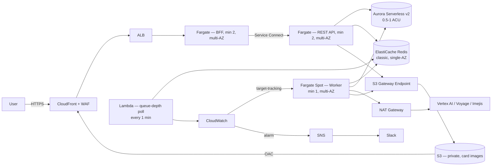

# AWS Architecture

The current AWS realization of the design in `Architecture.md`, component by
component, with the reasoning behind each choice and what's still
deliberately left open. `IaC.md` is the build plan for actually provisioning
this.

## Edge: CloudFront + WAF

One CloudFront distribution serves two things: the app itself (default
behavior, proxied to the BFF's ALB, nothing cached — including the SSE
route, which stays open for the duration of a generation run) and the
public card images (`/cards/*`, proxied to a private S3 bucket via Origin
Access Control, cached normally since the keys are content-addressed and
immutable). One distribution rather than two keeps it to one WAF Web ACL,
one certificate, one domain.

The Web ACL carries three rules — a rate-limit rule, and AWS's managed Core
Rule Set and Known Bad Inputs rule groups. It's attached at CloudFront, not
the ALB, for two concrete reasons: CloudFront's own per-ACL request-capacity
ceiling is substantially higher than a regional (ALB-scoped) one, and
**CloudFront doesn't bill its own request/data-transfer fee for anything WAF
blocks at the edge** (a 2024 pricing change) — so blocking bad traffic here
is both more headroom and strictly cheaper than letting it travel all the
way to the ALB first. The ALB's own security group is restricted to
CloudFront's managed prefix list, so the ALB can't be reached by skipping
CloudFront entirely.

AWS Shield Standard — automatic, free, included on CloudFront and the ALB —
handles network/transport-layer DDoS. WAF is a different, narrower thing: it
filters application-layer exploit patterns and request abuse, not volumetric
floods. The two are complementary, not substitutes for each other.

## Web server (BFF)

Fargate, not Lambda — decided deliberately, not by default. The SSE route
holds a connection open for the duration of a generation run (minutes), and
Lambda's request model is a poor fit for that: a standard API Gateway in
front would buffer the entire response or cut it off well under a minute,
and even the Lambda-native streaming path (`streamifyResponse`, Function
URLs only, no API Gateway) bills for the full held-open duration — a real,
ongoing cost that scales with generation volume, whereas Fargate's flat
per-task cost doesn't move regardless of how many connections it's holding.
Min 2 tasks, both AZs, autoscaling to 5, on **both** `ALBRequestCountPerTarget`
and CPU utilization as independent target-tracking policies — not
either/or. The workload is I/O-bound (mostly proxying), so CPU alone would
under-react to a real traffic spike; request count alone would miss a
genuinely CPU-heavy request. Both running together isn't redundant, it's
belt-and-suspenders at effectively no extra cost.

## REST API

No public entry point at all — the BFF is the only thing allowed to reach
it, over **ECS Service Connect** rather than a second (internal) ALB.
Service Connect's own sidecar proxy does real health-aware load balancing
across tasks and publishes a native `RequestCount` CloudWatch metric, which
is what the autoscaling policy tracks — getting the same scaling signal an
internal ALB would give, without paying for a second load balancer. Same
shape otherwise: min 2, both AZs, max 5, CPU + request-count target
tracking, p95/p99 latency alarms.

## Worker

Fargate **Spot**, min 1 task (not 2 — a worker gap just delays queue
processing, it isn't user-facing downtime the way a BFF/API gap would be),
spread across AZs rather than pinned to one, since Spot capacity
availability varies per AZ and diversifying reduces interruption frequency.
Spot is only a safe choice here *because* the generation job handler is
already resumable and idempotent (see `Architecture.md`) — a Spot
reclamation is functionally the same event as the BullMQ stalled-job
redelivery that originally motivated building that resumability, and both
are now handled the same way: a Postgres advisory lock stops a redelivered
job from racing a still-running one, and per-step checkpointing means a
genuinely-interrupted job resumes instead of restarting.

Autoscaling tracks Redis queue depth — but unlike SQS, Redis has no built-in
CloudWatch metric for "how many jobs are waiting," so a small scheduled
Lambda bridges the gap: every minute, it asks BullMQ for the waiting count
and publishes it as a custom CloudWatch metric, which a target-tracking
policy on the worker service scales against. This Lambda is the single
piece of this plan that exists purely to work around Redis not being a
managed AWS service with native queue-depth visibility — see "Pending
decisions" below.

## Data layer

**Aurora Serverless v2** for Postgres + pgvector, not plain RDS — the
traffic shape (long idle stretches, occasional bursts) suits Serverless v2's
true in-place elasticity (no failover or dropped connections scaling within
its ACU range) far better than hand-rolling autoscaling for a fixed RDS
instance, which has no native compute-autoscaling at all and would still
take a failover-like hit on every manual resize. Configured at
`min_capacity = 0.5`, true scale-to-zero accepted (roughly a 15-second
resume on the first request after real idle time — judged acceptable given
the app already tolerates brief reconnects by design). `max_capacity = 1` is
deliberately tight for now, a conscious trade given current load, not an
oversight — see "Pending decisions."

**ElastiCache Redis**, classic (cluster mode disabled), **not**
ElastiCache Serverless — Serverless's fixed `maxmemory-policy` is
incompatible with BullMQ, which specifically requires `noeviction` (losing a
queued job to eviction is a correctness bug for a job queue, not just a
performance one). Single node, no read replica, single-AZ — a deliberate,
revisit-later trade-off, not a blind spot (see "Pending decisions").

**S3**, private, fronted by CloudFront via Origin Access Control rather than
a public bucket. The images themselves are meant to be public (they're
shared on LinkedIn), but the bucket being public and the *objects* being
reachable are different things — a public bucket is an open door for
whatever gets added to it later by accident, not just what's in it today,
and OAC costs nothing extra given CloudFront's already in the picture.
API and worker both reach S3 over the **S3 Gateway VPC Endpoint** rather
than the NAT Gateway — free, and keeps that traffic off NAT's metered data
processing entirely.

**One NAT Gateway**, single-AZ, shared by both the worker's and the API's
outbound calls to Vertex AI, Voyage, and Imejis (the API calls these
directly too, for its synchronous edit/single-card routes — not just the
worker). The standard HA pattern is one NAT per AZ; this plan accepts the
single-NAT trade-off (cross-AZ data-transfer cost for tasks in the other AZ,
and a shared-fate outage if that one AZ has a problem) for the cost saving,
reasoning that the worker's jobs are already designed to be retryable rather
than time-critical.

## Secrets & IAM

Secrets split by who needs to read them, not consolidated for convenience:
one secret holding only the BFF→API bearer token, readable only by the
BFF's task role; a separate secret holding the external model/embedding/card
API credentials (Voyage, Imejis, Vertex AI), readable by the API's and
worker's task roles. The BFF has no IAM path to the LLM/embedding
credentials at all — it never calls those services, so it has no reason to
be able to read them, even though it shares the same VPC as everything that
does. Full reasoning and the Vertex-AI-specific credential question (static
service account key vs. Workload Identity Federation with AWS) is in
`IaC.md`.

## Monitoring and alerting

ElastiCache CPU and memory feed CloudWatch alarms into an SNS topic, which
posts to Slack (via AWS Chatbot, no custom code). Scaling Redis itself in
response is a **manual** action for now, not automated — see "Pending
decisions."

## Pending decisions

### Redis vs. SQS for the job queue

**Current choice: stay on Redis + BullMQ, specifically to avoid reworking
the existing flow.** Worth revisiting, and here's the honest trade either
way:

- **What SQS would remove entirely:** the queue-depth Lambda and its
  CloudWatch bridge, disappear completely — SQS publishes
  `ApproximateNumberOfMessagesVisible` to CloudWatch natively, and
  Application Auto Scaling can target-track a **metric math expression**
  (queue depth ÷ running task count) declared directly in the scaling
  policy, with zero custom code. SQS's redrive policy + `maxReceiveCount`
  also gives proper retry-then-dead-letter behavior, which the queue doesn't
  have today (BullMQ's `attempts` isn't configured, so a job that throws —
  as opposed to one that stalls — currently gets zero automatic retries).
- **What SQS would cost:** there's no SQS equivalent of BullMQ's
  `QueueEvents` push notifications, which is what currently feeds the live
  SSE progress relay. Since the database is already the real source of
  truth (see `Architecture.md`), the natural replacement is switching the
  SSE route from subscribing to Redis pub/sub to polling the run row every
  couple of seconds — a small, consistent simplification rather than a
  structural problem, but it is a real code change, not a drop-in swap.
- **Kafka/MSK was considered and ruled out** — meaningfully heavier
  operationally (cluster/broker/partition management) than either option,
  and its lag-based metrics are less turnkey for autoscaling than SQS's
  native one. Its actual strengths (massive sustained throughput, multiple
  independent consumer groups replaying one log) don't match this
  workload's shape (tens of thousands of independent, one-shot jobs, not a
  continuous high-volume stream).

### ElastiCache Multi-AZ

Deferred. A single node with no replica means a node failure doesn't just
cost availability — any run still sitting at `queued` with nothing yet
pulling it is silently stuck until the node's replaced. Adding one replica
with automatic failover is cheap relative to the rest of this stack; revisit
once it's worth the added cost, or sooner if the single-node risk actually
bites.

### Aurora's 1 ACU ceiling

Deliberately tight for current load. The ceiling that matters more than the
floor once real traffic grows — Serverless v2's whole value is scaling up
cleanly during a burst, and a cap this close to the floor leaves almost no
room to do that. Revisit as soon as usage data says it's worth it, before
it becomes a real bottleneck rather than a cost optimization.

### Redis vertical scaling

Manual for now (CloudWatch alarm → Slack → a human resizes the node), not
automated. ElastiCache has no alarm-triggered vertical-resize equivalent to
an EC2 ASG regardless — "Auto Scaling" in ElastiCache only applies to
cluster-mode-enabled deployments and only adds/removes shards or replicas,
never changes a node's instance type automatically. Building that
automation (a Lambda watching CloudWatch, calling `ModifyReplicationGroup`)
is a real future option if manual response ever proves too slow in
practice — not attempted yet since Redis's actual load here (BullMQ job
metadata, not cache traffic) is small and unlikely to need it soon.

### The one remaining duplicate-write window

Not AWS-specific, carried over from the application layer: the Postgres
advisory lock that protects a generation run from running twice
concurrently is scoped to the lock's own database connection staying alive.
A connection drop specific to that one session, while the rest of the job
keeps running on an external model call, could in principle let a second
attempt start before the first notices. Closing this fully means changing
how post regeneration frees up its `(topic_id, variant_index)` slot — a
separate, riskier change, deliberately not bundled into the resumability
work that already shipped.
